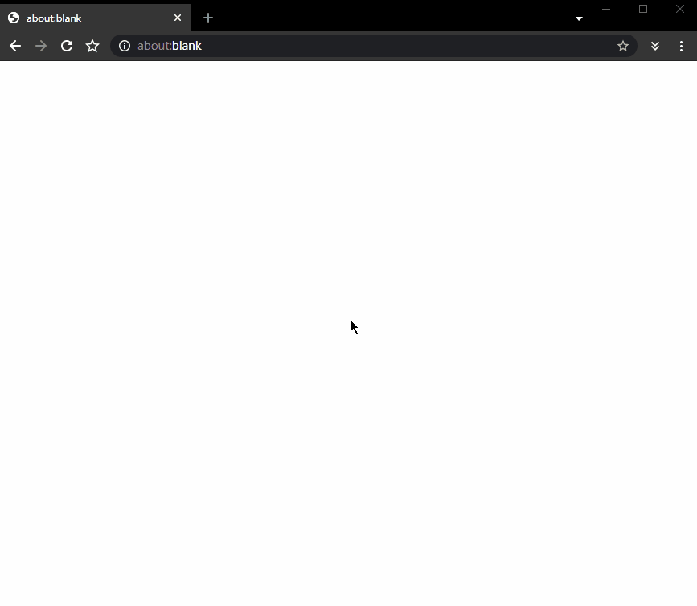
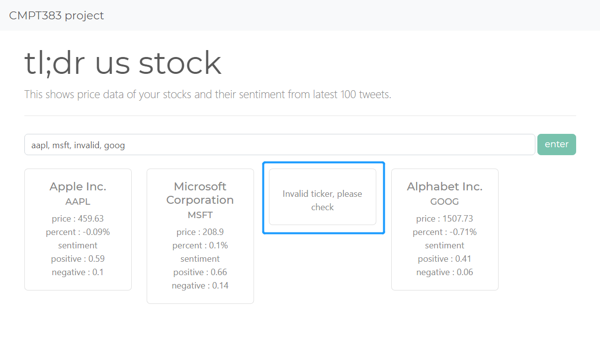

# CMPT 383 Project

*Name: Yang Zhang*

*SFU ID: 301356155*

## Get the project working

Please kindly follow the steps below:

```
# start vagrant
$ vagrant up

# ssh into the VM to get a command line
$ vagrant ssh

# change into project directory
$ cd project/

# use the provided script to start the project
$ ./startserver.sh

# if success, both the golang RPC server and django web server
# should start similar to this:

# Watching for file changes with StatReloader
# Performing system checks...
# 2020/08/16 22:19:36  [*] Awaiting RPC requests
# System check identified no issues (0 silenced).
# August 16, 2020 - 22:19:37
# Django version 3.1, using settings 'tldrusstock.settings'
# Starting development server at http://0.0.0.0:8000/
# Quit the server with CONTROL-C.
```

If the servers are started, open a web browser and input `localhost:8000`. When the web page is rendered, type some stock tickers and click the "enter" button. For each stock, the page will show a card that includes information related to the company stock: 



## Overall goal

The overall goal of the project is to provide a easy way of querying stock related data and their sentiment, and in future versions, perform stock trading (buy and sell selected stock or portfolio).

It tries to solve the problem of too much information related to public traded companies, as I believe the decision of buying or selling for an average human (not algorithm) in a stock market is essentially based on little amount of information. As a result, market sentiment could be important in determining whether a company is over- or under- valued.

Currently the web page shows the following information for a stock:

* company name
* stock ticker
* current market stock price
* percentage change of price
* positive and negative score of sentiment from 100 latest tweets related to the stock ticker

## Project component

The project has four components:

1. web page for displaying the information: coded in javascript using React.js
2. web server for handling request: coded in python using Django
3. sentiment analysis: coded in Python using `tweepy` API for searching tweets and `TextBlob` for analyzing sentiment
   * done in parallel by mapping each stock ticker to a function that does the analysis
4. retrieving stock data: coded in golang using `finance-go` package
   * done in parallel by mapping each stock ticker to a function that get the data
   * golang is used here because it is fast to obtain market data in parallel and, in future version, fast to perform trading which requires low latency

note: the "default" number of processors in `Vagrenfile` from project template is set to 2 so it might achieve some parallelism.

## Cross-language communication

The following two methods are used:

1. REST API between javascript frontend and django server where the frontend sends a `POST` request with the list of stock tickers and the server response is a Json string of the list of stocks and their information
2. A RabbitMQ message queue where the golang part is the RPC server that returns the list of stock price, and the Django server imports a function which is the RPC client that calls the golang part.

## Features to look for

Please look for the following features:

* responsive webpage: e.g. the number of stock cards shown in the page should adjust to the width of the browser

* current market price: the price and percentage change should be real-time if the stock is trading, or the closing price if the market is closed currently

* the card list should show stocks in same order as the input, see screenshot below

* invalid stock: if the input stock tick does not exist, the page should show an invalid card like below

  